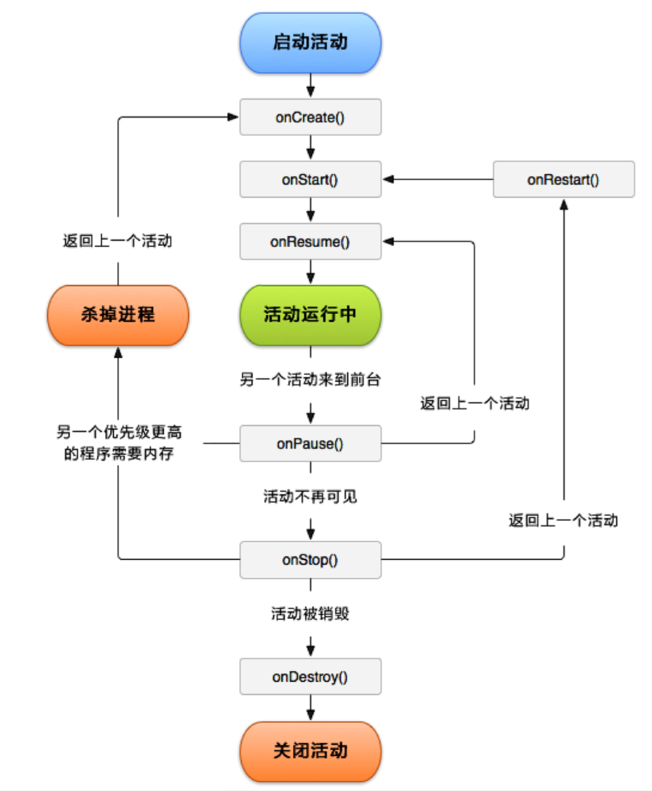

**Acitivity**  从创建到销毁，分别经历了 `onCreate`、`onStart`、`onResume`、`onPause`、`onStop`、`onDestory`等生命周期。

- 

1. **onCreate** 第一次创建时调用，通常用于加载布局、控件初始化、事件绑定等。

2. **onStart** 表示活动视图展示给用户，*可见不可操作*。

3. **onResume** Activity处于*栈顶*，当前处于运行状态，活动可操作，*可与用户交互*活动。

4. **onPause** 此时活动*可见但不可交互*，可做一些*持久化操作，如状态保存，停止动画*等，不能做耗时操纵。

5. **onStop** 活动对用户*不可见*，如果内存紧张时系统会直接结束这个活动而不会触发该方法， 所以保存状态信息是应该在 `onPause` 时做，而不是 `onStop` 时做。
6. **onDestroy**  活动销毁，如果内存紧张时系统会直接结束这个活动而不会触发该方法。
7. **onRestart**  处于停止状态的活动需要再次展现给用户的时候触发，后台切到前台，如Home键返回。

